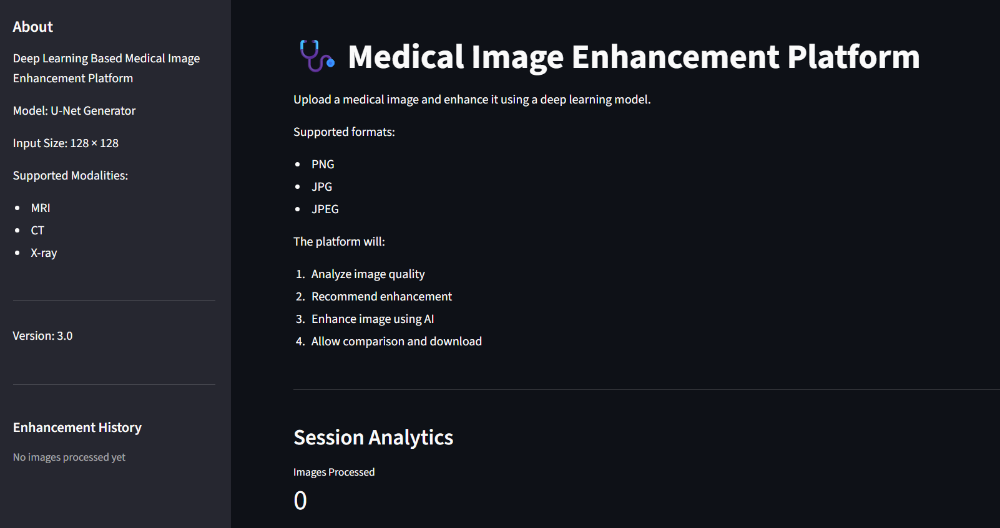
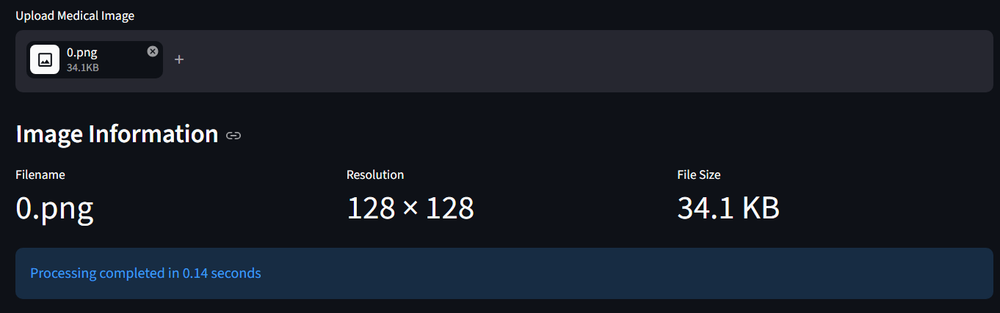
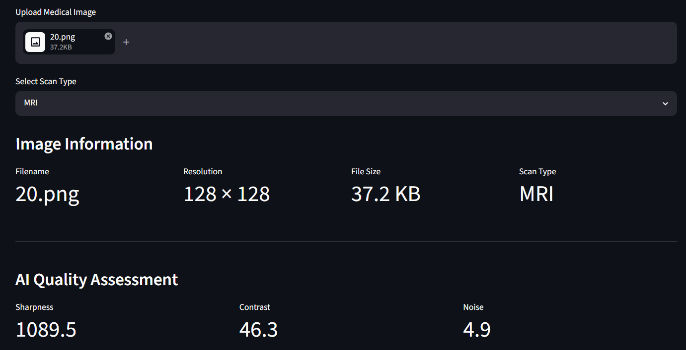
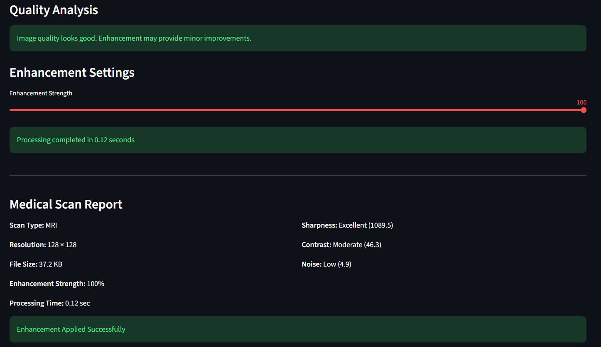
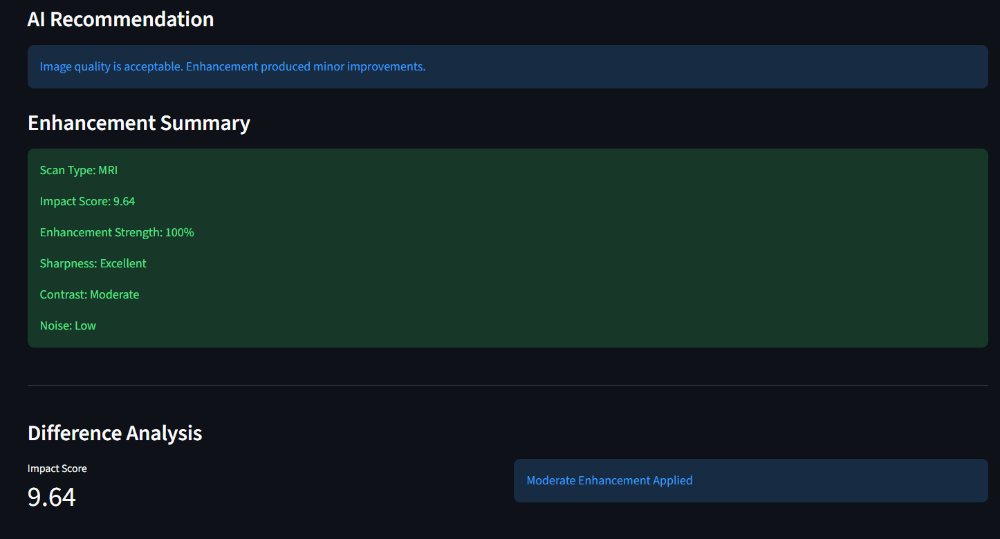
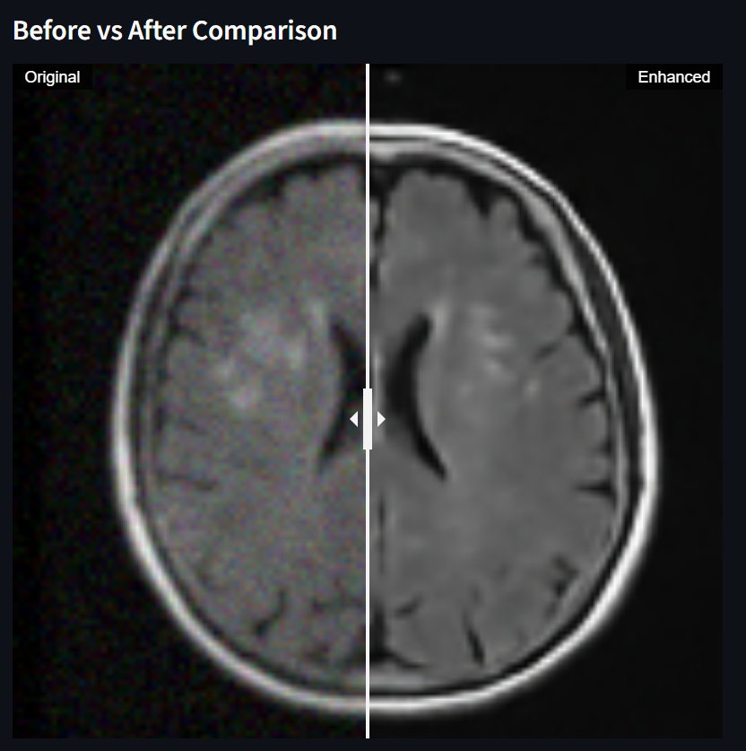
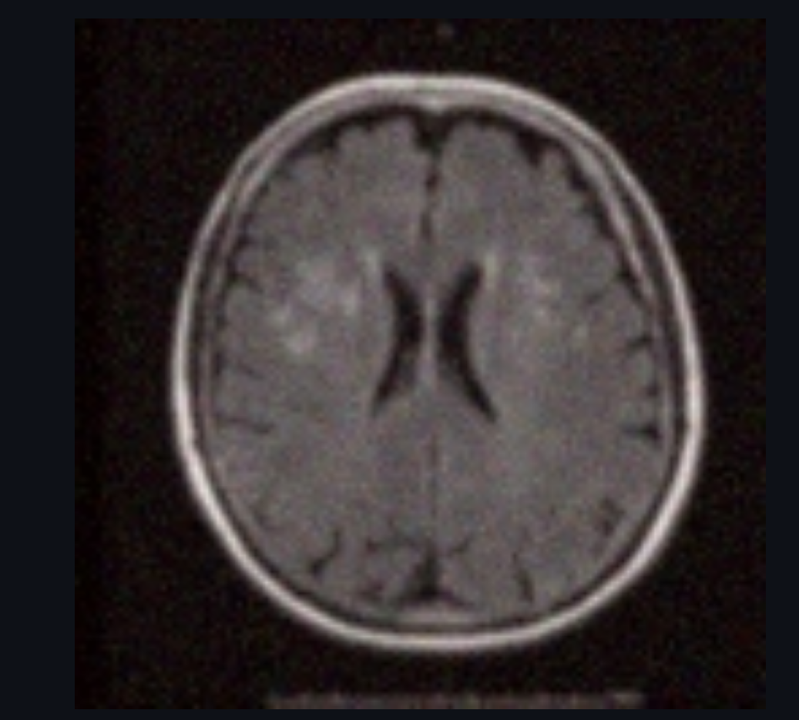
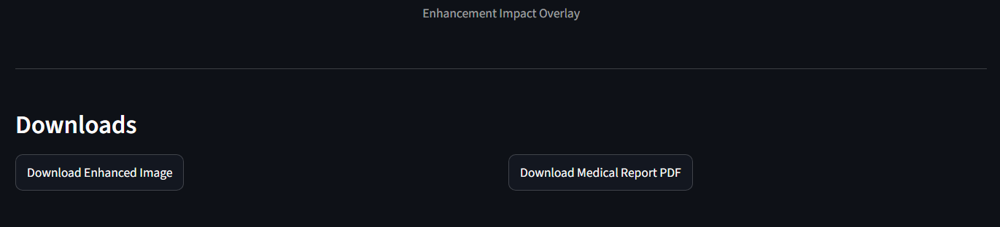

# Medical Image Enhancement Platform


A deep learning-powered web application that enhances noisy medical images using a trained U-Net-based image restoration model deployed with Streamlit. The platform allows users to upload images, compare original and enhanced outputs using an interactive slider, and download the processed result in real time.

---

## Live Demo

[](https://medical-enhancement-app-vadvkn9rrneucqypm2azwm.streamlit.app/)
---

## Features

### Deep Learning-Based Enhancement

* Medical image enhancement using TensorFlow
* U-Net-inspired architecture
* Real-time image processing and inference

### Interactive Comparison Slider

* Drag-and-drop before/after comparison
* Instant visual assessment of enhancement quality
* User-friendly image review experience

### Image Upload Pipeline

* Supports PNG, JPG, and JPEG formats
* Handles RGB, RGBA, and grayscale images
* Automatic preprocessing and normalization

### Image Analytics

* Displays uploaded filename
* Shows image resolution
* Displays file size information
* Tracks processing time

### Download Support

* Download enhanced images directly
* PNG output generation

### Deployment

* Publicly accessible web application
* Hosted on Streamlit Cloud
* Integrated with GitHub for automated deployment

---

## Application Screenshots

### Homepage



---

### Image Metadata & Processing Information






---

### Interactive Before vs After Comparison





---

## Technology Stack

### Frontend

* Streamlit

### Deep Learning

* TensorFlow
* Keras

### Image Processing

* OpenCV
* Pillow
* NumPy

### Visualization

* streamlit-image-comparison

### Deployment

* Streamlit Cloud
* GitHub

---

## Model Architecture

The application uses a U-Net-inspired encoder-decoder architecture trained for medical image enhancement.

### Input

* Image Size: 128 × 128
* RGB image input

### Output

* Enhanced image
* Reduced visual noise
* Improved structural clarity

---

## Workflow

1. Upload a medical image.
2. Image is validated and preprocessed.
3. Deep learning model performs enhancement.
4. Processing statistics are generated.
5. Interactive comparison slider displays results.
6. Enhanced image can be downloaded.

---

## Installation

Clone the repository:

```bash
git clone https://github.com/arshavsuman20/Medical-Enhancement-App.git
cd Medical-Enhancement-App
```

Install dependencies:

```bash
pip install -r requirements.txt
```

Run locally:

```bash
streamlit run app.py
```

---

## Project Structure

```text
Medical-Enhancement-App/
│
├── assets/
│   └── screenshots/
│       ├── home_page.png
│       ├── upload.png
│       ├── upload2.png
│       ├── upload3.png
│       ├── upload4.png
│       ├── slider.png
│       ├── difference_heatmap.png
│       └── download.png
│        
├── models/
│   └── final_model/
│
├── app.py
├── requirements.txt
└── README.md
```

---

## Key Achievements

* Developed and deployed a complete end-to-end deep learning application.
* Implemented real-time medical image enhancement.
* Integrated an interactive before/after comparison slider.
* Built a robust image upload and preprocessing pipeline.
* Added image metadata extraction and processing-time tracking.
* Deployed the application publicly using Streamlit Cloud.

---

### Future Improvements

* Higher-resolution image enhancement
* Improved model architecture
* Additional medical imaging modalities
* Batch image processing
* PSNR and SSIM quality metrics

---

## Author

**Arshav Suman**

GitHub: https://github.com/arshavsuman20

---

## License

This project is intended for educational, research, and portfolio purposes.
